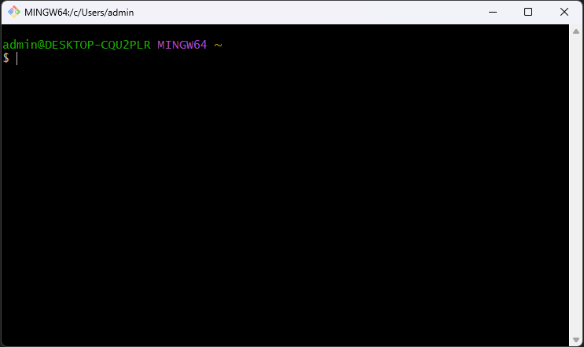
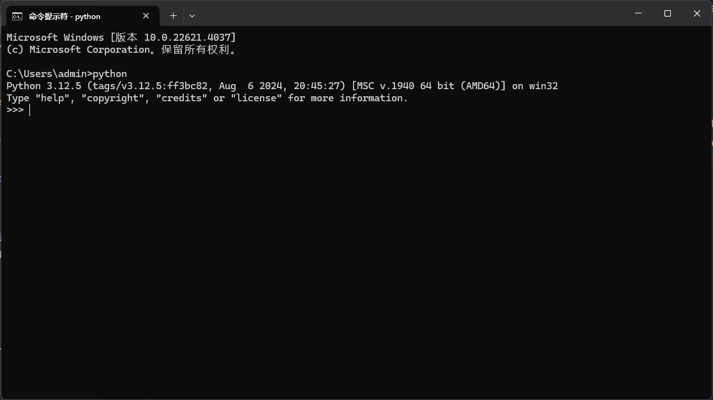

# Environment preparation for windows

## Git

1. Download git from <https://git-scm.com/download/win>, and then install.
2. After installed, open git from `Start menu` and get to work (e.g. clone code), just like the screenshot shown below.  
   

## Python

1. Download python from <https://www.python.org/downloads/>, and then install.  
2. During the installation process, you need to check the add python to system environment variable option.  
3. After installed, open cmd from `Start menu` and then type in `python` you will see below(if not you should check the system environment):  
     
4. config pip mirro in terminal window(for chinese mainland).  
   ```shell
   pip config set global.index-url https://pypi.tuna.tsinghua.edu.cn/simple
   ```
   
## Nodejs (developer need)

1. Download nodejs from <https://nodejs.org/>, and then install.
2. config npm mirror in terminal window(for chinese mainland).
   ```shell
   npm config set registry https://registry.npmmirror.com
   ```