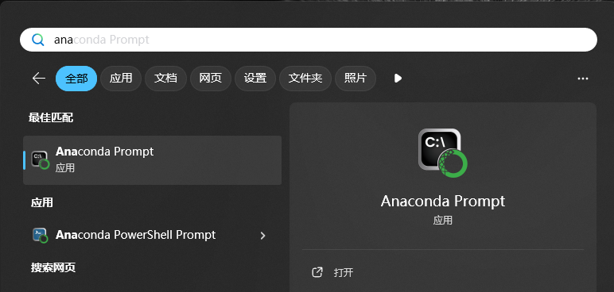
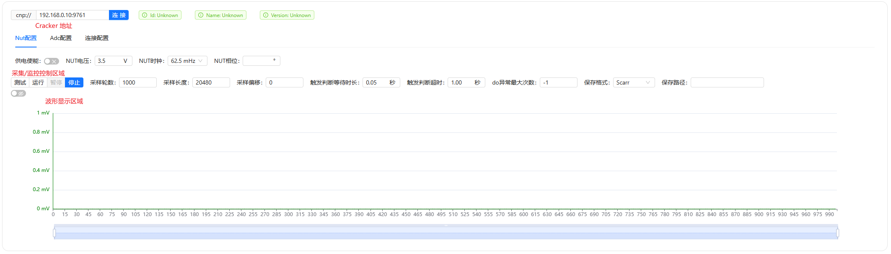

# 快速开始

`Crackunts`的上位机及分析程序采用`Python`开发，并且在`Jupyter`生态上构建了易于使用的UI库，可极大降低侧信道学习研究的难度。

## 环境准备

### Python 安装

#### Windows 下安装

在官网<https://www.python.org/>下载最新版`Python`，按照文档进行安装。

#### Linux/Mac 下安装

系统自带，无需安装。

### `pip` 镜像配置

`Python`环境安装结束后，推荐配置 `pip`镜像，可以提高国内下载速度，避免安装依赖失败。

- 阿里镜像（推荐）

  ```shell
  pip config set global.index-url https://mirrors.aliyun.com/pypi/simple
  pip config set install.trusted-host mirrors.aliyun.com
  ```

- 清华镜像（暂时不推荐，镜像仓库没有同步`cracknuts`库）

  ```shell
  pip config set global.index-url https://pypi.tuna.tsinghua.edu.cn/simple/
  pip config set install.trusted-host pypi.tuna.tsinghua.edu.cn
  ```

### 虚拟环境

推荐在开启虚拟环境进行开发，如`conda`、`vevn`、`virtualenv`等，可以避免由于不同项目引入相同库的不同版本造成的已有`Python`开发环境的破坏。以下以`conda`和`venv`举例说明配置方法，任选其一使用即可

#### `Conda`虚拟环境

按照官网<https://docs.anaconda.com/miniconda/>，教程安装即可（如已安装，略过）。

##### 配置源（可选）

由于国内下载速度较慢，可配置镜像，加速环境创建时的速度。

清华源

```shell
conda config --add channels https://mirrors.tuna.tsinghua.edu.cn/anaconda/pkgs/free/
conda config --add channels https://mirrors.tuna.tsinghua.edu.cn/anaconda/pkgs/main/
conda config --add channels https://mirrors.tuna.tsinghua.edu.cn/anaconda/cloud/conda-forge/
#设置搜索时显示通道地址
conda config --set show_channel_urls yes
```

中科大源

```shell
conda config --add channels https://mirrors.ustc.edu.cn/anaconda/pkgs/main/
conda config --add channels https://mirrors.ustc.edu.cn/anaconda/pkgs/free/
conda config --add channels https://mirrors.ustc.edu.cn/anaconda/cloud/conda-forge/
conda config --add channels https://mirrors.ustc.edu.cn/anaconda/cloud/msys2/
conda config --add channels https://mirrors.ustc.edu.cn/anaconda/cloud/bioconda/
conda config --add channels https://mirrors.ustc.edu.cn/anaconda/cloud/menpo/
 #设置搜索时显示通道地址
conda config --set show_channel_urls yes
```

上海交通大学源

```shell
conda config --add channels https://mirrors.sjtug.sjtu.edu.cn/anaconda/pkgs/main/
conda config --add channels https://mirrors.sjtug.sjtu.edu.cn/anaconda/pkgs/free/
conda config --add channels https://mirrors.sjtug.sjtu.edu.cn/anaconda/cloud/conda-forge/
 
# 设置搜索时显示通道地址
conda config --set show_channel_urls yes
```

##### 创建CrackNuts使用环境

在Windows中，开始菜单搜索`ananconda`进入`conda`命令行窗口



执行如下命令创建名称为`cracknuts`，python版本为`3.12.x`的虚拟环境

```shell
conda create -n cracknuts python=3.12
```

激活虚拟环境

```shell
conda activate cracknuts
```

#### `virtualenv` 虚拟环境

使用 `venv`虚拟环境，需要系统中安装有3.12.0以上版本的`Python`。

安装 `virtualenv`

在命令行执行

```shell
pip install pipx 
pipx install virtualenv
```

创建`CrackNuts`文件夹，作为工作区，在命令行中进入该目录，并执行如下命令创建`vevn`虚拟环境。这里需要把<>替换为你电脑的`Python`目录

```shell
virtualenv -p <\paht\to\Python312\python.exe> --prompt cracknuts .venv
```

激活虚拟环境

Windows

```shell
.venv/script/activate
```

Linxu/Mac

```shell
source .venv/bin/activate
```


## 安装

开篇提到过，`CrackNuts`提供`Python`的上位机SDK，可以仅仅安装该SDK `cracknuts`即可实现纯`Python`下的设备管理，如果需要在`Jupyter`中进行开发，可安装`cracknuts-panel`

**纯Python环境**

*推荐用户对`cracknuts`库熟悉后在使用，可直接编写python脚本进行波形采集等操作不必局限在`Jupyter`环境。*

```shell
pip install cracknuts
```

**在 `Jupyter` 运行** 

```shell
pip install cracknuts-panel
```

安装成功后，在`Jupyter`中(命令行中执行`jupyter lab`启动jupyter)运行如下代码，创建基础的采集流程

```python
# 引入依赖
from cracknuts.cracker.basic_cracker import CrackerS1
from cracknuts.cracker.stateful_cracker import StatefulCracker

# 创建 mock cracker 
cracker = CrackerS1(('localhost', 9761))
# 创建 stateful cracker
cracker = StatefulCracker(cracker)
```

---

```python
# 引入流程控制模板
from cracknuts.acquisition import Acquisition as template
import time

def do(cracker):
    # 循环中的数据写入，如：明文等
    time.sleep(0.1) # 模拟操作
    return b'123123' # 模拟返回保存的明文数据

# 通过模板构造 acquistion 实体
acq = template.builder().cracker(cracker).init(lambda _: None).do(do).build()
```

```python
# 引入 cracknuts 面板
from cracknuts_panel import display_cracknuts_panel

# 创建面板
cp = display_cracknuts_panel(acq)
cp
```

执行后展示效果如下：


### 安装`Scarr`（可选）

`Cracknuts`推荐使用`scarr`[https://github.com/decryptofy/scarr.git](https://github.com/decryptofy/scarr.git)框架进行分析，如果采用，则按照如下命令进行安装：

1. 下载或克隆scarr仓库到本地
2. 进入仓库目录
3. 执行如下命令

```shell
# 克隆仓库
git clone https://github.com/decryptofy/scarr.git
# 进入仓库目录
cd scarr
# 安装
pip install .
```


## 采集波形

在`Jupyter`中，使用`cracknuts_panel`面板对设备及采集流程进行控制，其界面如下，



## 分析波形

todo

