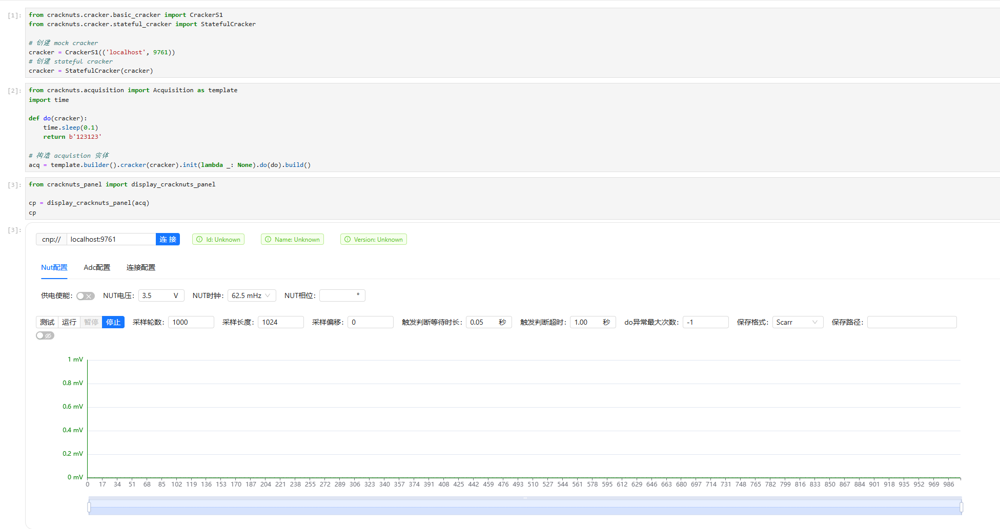

# Getting started


## Install

```shell
pip install cracknuts
```


## Run on `Jupyter` 

`CrackNuts` usage in `Jupyter` 

### Install

```shell
pip install cracknuts-panel
pip install jupyter
```


Write code on a `Jupyter notebook` like below.

