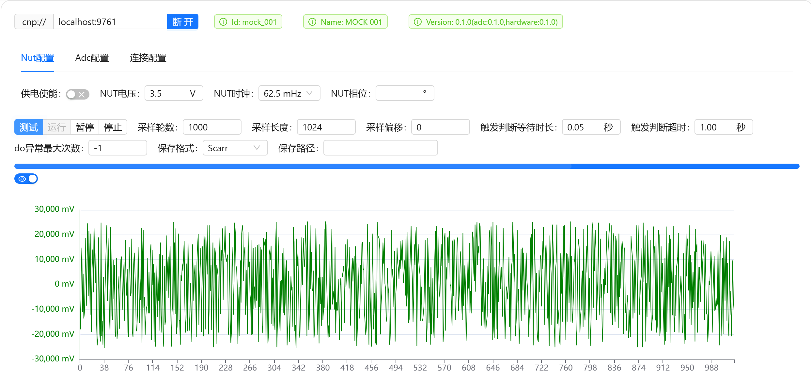

# 快速开始

推荐在开启虚拟环境进行开发，如`conda`、`vevn`、`virtualenv`。

## 国内镜像优化

### pip 镜像配置

- 阿里镜像（推荐）

  ```shell
  pip config set global.index-url https://mirrors.aliyun.com/pypi/simple
  pip config set install.trusted-host mirrors.aliyun.com
  ```

- 清华镜像（暂时不推荐，镜像仓库没有同步cracknuts库）

  ```shell
  pip config set global.index-url https://pypi.tuna.tsinghua.edu.cn/simple/
  pip config set install.trusted-host pypi.tuna.tsinghua.edu.cn
  ```

## 安装

### 纯Python环境

```shell
pip install cracknuts
```

### 在 `Jupyter` 运行 

```shell
pip install cracknuts-panel
pip install jupyter
```

安装成功后，按照下图运行成功即可

```python
# 引入依赖
from cracknuts.cracker.basic_cracker import CrackerS1
from cracknuts.cracker.stateful_cracker import StatefulCracker

# 创建 mock cracker 
cracker = CrackerS1(('localhost', 9761))
# 创建 stateful cracker
cracker = StatefulCracker(cracker)
```

---

```python
# 引入流程控制模板
from cracknuts.acquisition import Acquisition as template
import time

def do(cracker):
    # 循环中的数据写入，如：明文等
    time.sleep(0.1) # 模拟操作
    return b'123123' # 模拟返回保存的明文数据

# 通过模板构造 acquistion 实体
acq = template.builder().cracker(cracker).init(lambda _: None).do(do).build()
```

```python
# 引入 cracknuts 面板
from cracknuts_panel import display_cracknuts_panel

# 创建面板
cp = display_cracknuts_panel(acq)
cp
```

执行后展示效果如下：



### 安装`Scarr`（可选）

`Cracknuts`推荐使用`scarr`[https://github.com/decryptofy/scarr.git](https://github.com/decryptofy/scarr.git)框架进行分析，如果采用，则按照如下命令进行安装：

1. 下载或克隆scarr仓库到本地
2. 进入仓库目录
3. 执行如下命令

```shell
# 克隆仓库
git clone https://github.com/decryptofy/scarr.git
# 进入仓库目录
cd scarr
# 安装
pip install .
```


## 采集波形

todo

## 分析波形

todo

