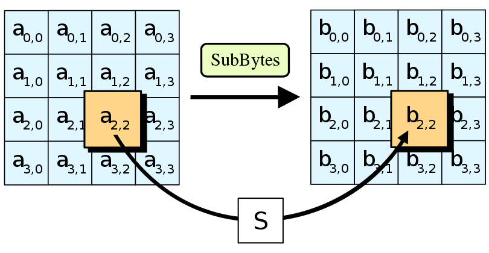
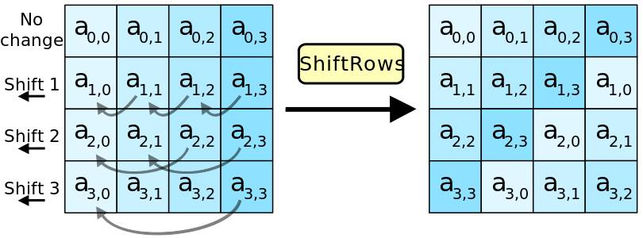
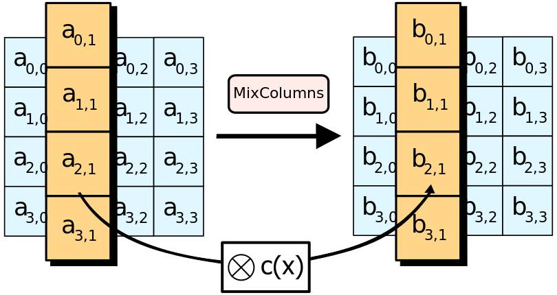
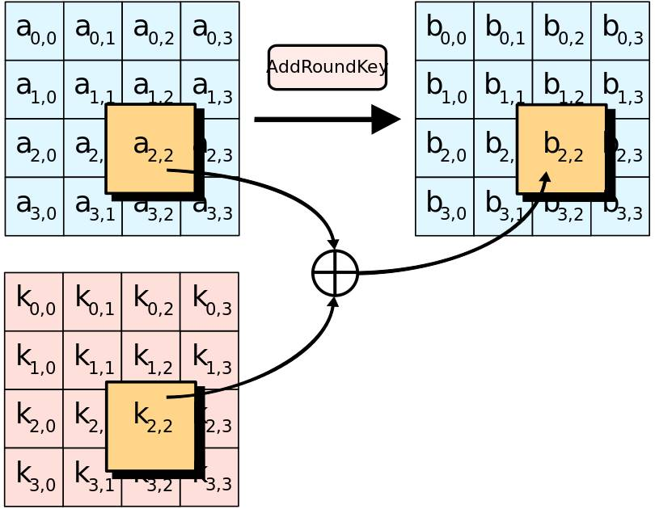
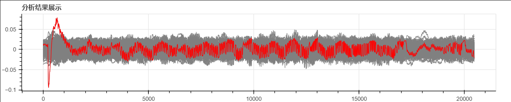
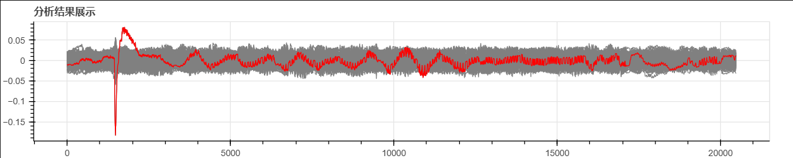
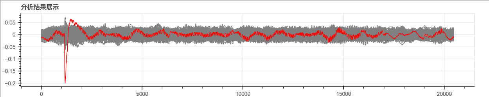
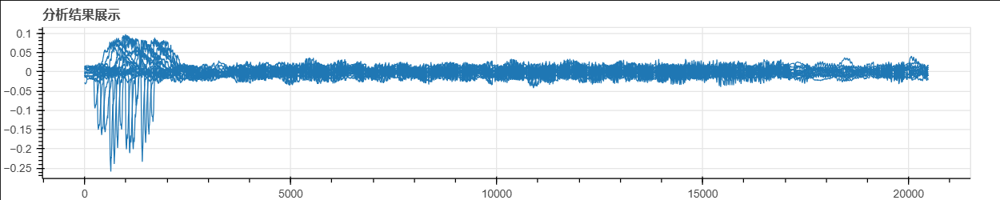

# 相关能量分析（CPA）介绍
这里以AES算法为例来介绍CPA

---
## AES算法简介
AES是由美国国家标准与技术研究院（NIST）在2001年发布的，旨在取代早期的DES标准，提供更高安全性的加密方法。AES是一种对称加密算法,它支持128位、192位和256位的密钥长度，对应的轮数为10，12，14轮。

### AES工作原理  
AES算法通过多轮次的置换-置换网络（SPN）结构来实现加密过程，在第一轮之前，AES先将明文与白化密钥相异或。每轮操作包括以下四个步骤（最后一轮不做列混合）：

- 字节替换（SubBytes）：使用S盒进行非线性置换，增加数据混淆。  
- 行移位（ShiftRows）：不同行进行循环左移，进一步扩散数据。  
- 列混合（MixColumns）：除最后一轮外，使用固定矩阵进行乘法运算，混淆数据。  
- 轮密钥加（AddRoundKey）：将轮密钥与数据块进行异或运算，融入密钥信息

字节替换的示例图如下：



行移位示意图：



列混合示意图：



轮密钥异或示意图：



## CPA分析的位置

由于我们的分析对象是软件实现的AES，为了便于进行CPA分析的演示和说明，我们以第一轮字节替换层的输出为对象进行分析，使用的泄漏模型为汉明重量模型，即计算第一轮S盒的输出汉明重量HW$(S(p \oplus k))$与曲线的相关系数。其中$p$为明文的一个字节，$k$为猜测的白化密钥的一个字节。

相关系数是衡量两个变量之间线性关系强度和方向的统计量。在CPA（Correlation Power Analysis）攻击中，通常使用皮尔逊相关系数（Pearson Correlation Coefficient）来衡量实际测量的能量迹与根据猜测密钥计算的预期功耗之间的相关性。

皮尔逊相关系数的计算公式如下：

$$
r_{i,j} = \frac{\sum_{d=1}^{D} (h_{d,i} - \bar{h}_i)(t_{d,j} - \bar{t}_j)}{\sqrt{\sum_{d=1}^{D} (h_{d,i} - \bar{h}_i)^2 \sum_{d=1}^{D} (t_{d,j} - \bar{t}_j)^2}}
$$

其中：
* $r_{i,j}$ 是相关系数。
* $ h_{d,i} $ 是第 $ d $ 个样本在第 $ i $ 个猜测密钥下的汉明重量。
* $ \bar{h}_i $ 是第 $ i $ 个猜测密钥下所有样本的汉明重量的平均值。
* $ t_{d,j} $ 是第 $ d $ 个能量迹在第 $ j $ 个时间点的功耗值。
* $ \bar{t}_j $ 是所有能量迹在第 $ j $ 个时间点的功耗值的平均值。
* $ D $ 是样本数量或时间点的数量。

相关系数的值范围在 -1 到 1 之间，其中： 
* 1 表示完全正相关，即随着一个变量的增加，另一个变量也增加。
* -1 表示完全负相关，即随着一个变量的增加，另一个变量减少。
* 0 表示没有线性相关。

在CPA攻击中，攻击者会计算每个猜测密钥的相关系数，并寻找最高值，这个最高值对应的猜测密钥很可能是正确的密钥。

### NUT的AES实现

NUT的无防护的AES实现使用的是mbedTLS的查小表实现。对于这种实现，对其进行CPA分析时，与教科书AES实现（即前面所讲的AES实现）是一样的。

### 能量迹采集
采集的过程见参 [采集过程](temp.ipynb)

采集出来的能量迹曲线如下图所示


```python
from cracknuts.solver.trace import ScarrTraceDataset
import cracknuts_panel as panel

# scarr_trace_dataset = ScarrTraceDataset.load("E:\\codes\\cracknuts_panel\\demo\\dataset\\20241014200306.zarr")
scarr_trace_dataset = ScarrTraceDataset.load("E:\\codes\\cracknuts_panel\\demo\\dataset\\20241016221712.zarr")
tap = panel.display_trace_analysis_panel()
tap.set_trace_dataset(scarr_trace_dataset)
tap
```


    TraceAnalysisPanelWidget(trace_series_list=[{'name': '0-0', 'data': array([89, 87, 85, ..., 56, 59, 63], dtype…


## CPA分析展示

> 下面使用scarr库（https://github.com/decryptofy/scarr.git） 来进行AES的CPA分析展示。  
> python版本要求：python 3.10以上  
> 依赖包安装过程：  
> git clone https://github.com/decryptofy/scarr.git  
> cd scarr  
> pip install .


```python
from scarr.engines.cpa import CPA as cpa
from scarr.file_handling.trace_handler import TraceHandler as th
from scarr.model_values.sbox_weight import SboxWeight
from scarr.container.container import Container, ContainerOptions
import numpy as np
from smartcard.util import toHexString, toBytes
```

指定要分析的能量迹文件：


```python
# dataset_name = 'aes_nut1.zarr'
dataset_name = 'dataset\\20241016222554.zarr'
```


```python
handler2 = th(fileName=dataset_name) 
```

    opened zarr file  dataset\20241016222554.zarr


分析模型为汉明重量模型：


```python
model = SboxWeight() 
engine2 = cpa(model)
```

对所有16个密钥字节进行分析：


```python
container2 = Container(options=ContainerOptions(engine=engine2, handler=handler2), model_positions = [x for x in range(16)])
container2.run()
```

获取所计算出来的相关系数矩阵，存于变量results2中：


```python
results2 = container2.engine.get_result()
```

获取每个字节最大相关系数所对应的密钥，存于results中：


```python
results = np.squeeze(engine2.get_candidate())
```

results存储的是各个字节的密钥的计算结果，我们将其以16进制打印出来，可见是正确的密钥。


```python
toHexString(list(results))
```


    '11 22 33 44 55 66 77 88 99 00 AA BB CC DD EE FF'


将第0字节所对应的相关系数矩阵取出，并存于变量result中，以方便后面的演示：


```python
result = np.squeeze(results2)
result = result[0]
```


```python
candidate = [None for _ in range(result.shape[0])]

for i in range(result.shape[0]):
    candidate[i] = np.unravel_index(np.abs(result[i, :]).argmax(), result[i, :].shape[0:])[0]
```


```python
candidates = np.empty(256, dtype=np.float64)
for k in range(256):
    candidates[k] = result[k,candidate[k]]
ck = np.abs(candidates).argmax()
```

把第0字节相关性最大的前10个相关系数及其对应的密钥猜测值打印出来。这10个密钥即为这个字节的前10个密钥候选值。一般来说，第1个候选值所对应的相关系数如果和第2候选值相差较大，我们便认为它是正确的密钥。


```python
for _i in range(0, 10):
    print('第',str(_i+1),'个候选值：',hex(np.abs(candidates).argsort()[::-1][_i]),'， 对应的相关系数为：',str(candidates[np.abs(candidates).argsort()[::-1][_i]]))

```

    第 1 个候选值： 0x11 ， 对应的相关系数为： -0.09418851882219315
    第 2 个候选值： 0x64 ， 对应的相关系数为： 0.04906101152300835
    第 3 个候选值： 0x2d ， 对应的相关系数为： 0.04768433794379234
    第 4 个候选值： 0x25 ， 对应的相关系数为： 0.047402579337358475
    第 5 个候选值： 0x8b ， 对应的相关系数为： 0.045078057795763016
    第 6 个候选值： 0x6b ， 对应的相关系数为： 0.043277524411678314
    第 7 个候选值： 0x91 ， 对应的相关系数为： -0.04266839846968651
    第 8 个候选值： 0xec ， 对应的相关系数为： -0.04256479814648628
    第 9 个候选值： 0x40 ， 对应的相关系数为： 0.04255108907818794
    第 10 个候选值： 0xa1 ， 对应的相关系数为： 0.04235619679093361


把第0个字节的256个密钥猜测下的相关系数曲线画出来。正确密钥用红色画出，其它密钥用灰色画出。可以看出正确密钥对应的相关系数曲线存在最明显的尖峰。


```python
from bokeh.plotting import figure, show, output_notebook
from bokeh.models import ColumnDataSource, HoverTool

output_notebook() 

p = figure(width=1000, height=200, title="分析结果展示")
for _i in range(0, 256):
    p.line(np.arange(0, 20480), results2[0,0,0,_i,:].T, color='gray')
p.line(np.arange(0, 20480), results2[0,0,0,0x11,:].T, color="red")
hover = HoverTool()
hover.tooltips = [
    ("index", "$index"),
    ("(x,y)", "($x, $y)"),
]
p.add_tools(hover)
show(p)
```





把第1个字节的256个密钥猜测下的相关系数曲线画出来。正确密钥用红色画出，其它密钥用灰色画出。可以看出正确密钥对应的相关系数曲线存在最明显的尖峰。


```python
p = figure(width=1000, height=200, title="分析结果展示")
for _i in range(0, 256):
    p.line(np.arange(0, 20480), results2[0,1,0,_i,:].T, color='gray')
p.line(np.arange(0, 20480), results2[0,1,0,0x22,:].T, color="red")
hover = HoverTool()
hover.tooltips = [
    ("index", "$index"),
    ("(x,y)", "($x, $y)"),
]
p.add_tools(hover)
show(p)
```





把第2个字节的256个密钥猜测下的相关系数曲线画出来。正确密钥用红色画出，其它密钥用灰色画出。可以看出正确密钥对应的相关系数曲线存在最明显的尖峰。


```python
p = figure(width=1000, height=200, title="分析结果展示")
for _i in range(0, 256):
    p.line(np.arange(0, 20480), results2[0,2,0,_i,:].T, color='gray')
p.line(np.arange(0, 20480), results2[0,2,0,0x33,:].T, color="red")
hover = HoverTool()
hover.tooltips = [
    ("index", "$index"),
    ("(x,y)", "($x, $y)"),
]
p.add_tools(hover)
show(p)
```





把所有16个字节正确密钥对应的相关系数曲线画出来，以便观察它们的时间点。


```python
p = figure(width=1000, height=200, title="分析结果展示")
p.line(np.arange(0, 20480), results2[0,0,0,0x11,:].T)
p.line(np.arange(0, 20480), results2[0,1,0,0x22,:].T)
p.line(np.arange(0, 20480), results2[0,2,0,0x33,:].T)
p.line(np.arange(0, 20480), results2[0,3,0,0x44,:].T)
p.line(np.arange(0, 20480), results2[0,4,0,0x55,:].T)
p.line(np.arange(0, 20480), results2[0,5,0,0x66,:].T)
p.line(np.arange(0, 20480), results2[0,6,0,0x77,:].T)
p.line(np.arange(0, 20480), results2[0,7,0,0x88,:].T)
p.line(np.arange(0, 20480), results2[0,8,0,0x99,:].T)
p.line(np.arange(0, 20480), results2[0,9,0,0x00,:].T)
p.line(np.arange(0, 20480), results2[0,10,0,0xaa,:].T)
p.line(np.arange(0, 20480), results2[0,11,0,0xbb,:].T)
p.line(np.arange(0, 20480), results2[0,12,0,0xcc,:].T)
p.line(np.arange(0, 20480), results2[0,13,0,0xdd,:].T)
p.line(np.arange(0, 20480), results2[0,14,0,0xee,:].T)
p.line(np.arange(0, 20480), results2[0,15,0,0xff,:].T)
hover = HoverTool()
hover.tooltips = [
    ("index", "$index"),
    ("(x,y)", "($x, $y)"),
]
p.add_tools(hover)
show(p)
```




## 参考

- AES算法图片参考：https://blog.51cto.com/u_15127650/2834120
